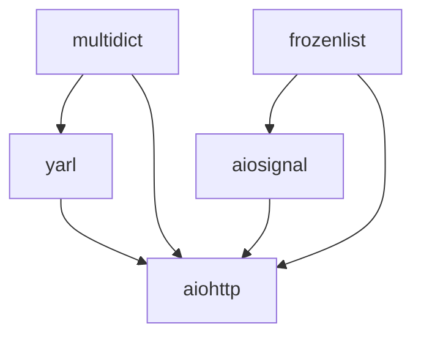

# Examples

A complete, runnable walkthrough of ezgitx on a realistic multi-repo
workspace. Every command and block of output below is real. Run them and
you'll get the same shape of result.

_Captured 2026-06-13 against ezgitx 0.1.0. The upstream repos drift over time;
if a step looks different from what you see, the exact commits this was run
against are listed under [Notes](#notes)._

This walkthrough uses **Claude Code** as the coding agent. The `ezgitx`
commands are identical everywhere. The pasted setup prompt in step 3 works
with any agent, but `ezgitx init-skill` (step 8) writes a Claude Code skill
file at `.claude/skills/ezgitx/SKILL.md`; other coding agents use different
instruction-file conventions, so swap that step for yours.

## A private multi-repo platform

Picture the backend platform at your company. It isn't one repo, it's five,
each on its own release cadence:

- two foundational utility libraries with no internal dependencies,
- two higher-level libraries built on top of those,
- and the service you actually ship, built on all of them.

You can't hand a stranger your company's private repos, so this walkthrough
stands them in with five real, public packages that happen to have exactly
that dependency shape: the `aio-libs` stack behind `aiohttp`. Treat the names
as if they were your own internal repos.

| Role in the "platform" | Real repo | Builds on (in this workspace) |
|---|---|---|
| foundational library | `multidict` | none |
| foundational library | `frozenlist` | none |
| higher-level library | `yarl` | `multidict` |
| higher-level library | `aiosignal` | `frozenlist` |
| the shipped service | `aiohttp` | `multidict`, `yarl`, `frozenlist`, `aiosignal` |



The point isn't aiohttp. It's that this is the shape of workspace ezgitx is
built for: separate repos that build on each other locally. Unlike your
private platform, you can run this one yourself.

## 1. Clone the workspace

```sh
mkdir acme && cd acme
git clone https://github.com/aio-libs/multidict.git
git clone https://github.com/aio-libs/frozenlist.git
git clone https://github.com/aio-libs/yarl.git
git clone https://github.com/aio-libs/aiosignal.git
git clone --recurse-submodules https://github.com/aio-libs/aiohttp.git
```

`aiohttp` vendors `llhttp` as a git submodule, so it needs
`--recurse-submodules` or its build fails later. That's an aiohttp quirk, not
an ezgitx one; your own repos may have none.

## 2. Create one shared environment

The repos install into a single environment so the higher-level ones build
against the **local** copies of the lower-level ones, not published releases:

```sh
python3 -m venv .venv
source .venv/bin/activate
pip install -U pip setuptools wheel
```

Keep this environment active in the shell you run ezgitx from. ezgitx's child
build commands inherit it.

## 3. Let your agent write the config

Don't hand-write the YAML. Open Claude Code at the workspace root and tell it
to set ezgitx up. Since you know your own workspace, just describe the local
relationships:

> I'm adopting ezgitx (https://github.com/yuval-r/ezgitx) in this workspace.
> These five repos are a co-developed local stack, installed editable into the
> shared `.venv`: `yarl` builds on `multidict`, `aiosignal` builds on
> `frozenlist`, and `aiohttp` builds on all four. Generate `.ezgitx.yml` at the
> root with one `platform` group: each repo gets a `pip install -e .` build
> command, and `depends_on` edges for exactly those local relationships.
> `aiohttp` needs `AIOHTTP_NO_EXTENSIONS=1` prefixed on its command. Then run
> `ezgitx status` to validate it.

The README has a fuller, evidence-first version of this prompt under
[Or let your agent write the config](README.md#or-let-your-agent-write-the-config),
which reads each repo's manifests and derives the commands itself.

The agent reads the repos and writes this:

```yaml
version: 1
groups:
  platform:
    - path: ./multidict
      default_cmd: "pip install -e ."
      check_cmd: "python -c 'import multidict'"
    - path: ./frozenlist
      default_cmd: "pip install -e ."
      check_cmd: "python -c 'import frozenlist'"
    - path: ./yarl
      default_cmd: "pip install -e ."
      check_cmd: "python -c 'import yarl'"
      depends_on: ["multidict"]
    - path: ./aiosignal
      default_cmd: "pip install -e ."
      check_cmd: "python -c 'import aiosignal'"
      depends_on: ["frozenlist"]
    - path: ./aiohttp
      default_cmd: "AIOHTTP_NO_EXTENSIONS=1 pip install -e ."
      check_cmd: "python -c 'import aiohttp'"
      depends_on: ["multidict", "yarl", "frozenlist", "aiosignal"]
```

Two things to check in what it produced:

- `depends_on` should appear only where a repo consumes another from this
  workspace, which here means the local editable installs, never a plain PyPI
  dependency. That rule is what makes staleness mean something, so don't let
  the agent wire an edge for a package that would come from the registry.
- `aiohttp`'s command carries `AIOHTTP_NO_EXTENSIONS=1`, because building its
  C speedups from a git checkout needs a Cython step pip won't run for you. A
  repo's per-repo `default_cmd` is where its build quirks belong.

## 4. Build everything, in dependency order

```sh
ezgitx run --all --with-deps
```

ezgitx builds the two foundational libraries first, then the two that depend
on them, then the service. One JSONL line per repo as it finishes, then a
summary (stdout trimmed here):

```jsonl
{"repo":"multidict","exit_code":0,"duration_ms":1984,"stdout_tail":"...Successfully installed multidict-6.7.2.dev0"}
{"repo":"frozenlist","exit_code":0,"duration_ms":5009,"stdout_tail":"...Successfully installed frozenlist-1.8.1.dev0"}
{"repo":"aiosignal","exit_code":0,"duration_ms":933,"stdout_tail":"...Requirement already satisfied: frozenlist>=1.1.0 in …/.venv/… (1.8.1.dev0)..."}
{"repo":"yarl","exit_code":0,"duration_ms":4454,"stdout_tail":"...Requirement already satisfied: multidict>=4.0 in …/.venv/… (6.7.2.dev0)..."}
{"repo":"aiohttp","exit_code":0,"duration_ms":992,"stdout_tail":"...Requirement already satisfied: multidict<7.0,>=4.5 …(6.7.2.dev0); yarl<2.0,>=1.17.0 …(1.24.2)..."}
{"type":"summary","total":5,"passed":5,"failed":0,"duration_ms":10482}
```

Look at `yarl` and `aiohttp`: `Requirement already satisfied: multidict …
(6.7.2.dev0)`. They resolved their dependency to the **local checkout you just
built**, not a PyPI download, because ezgitx installed `multidict` first.
Build `yarl` before `multidict` and pip pulls a published `multidict` instead.
The ordering is the whole point.

Genuinely external dependencies (`idna`, `propcache`, and friends) still come
from PyPI, as they should. ezgitx only orders what you declared.

## 5. The whole workspace at a glance

```sh
ezgitx status --all --human
```

```
REPO        BRANCH  HEAD     STATE  AHEAD  BEHIND  STALE_DEPS
multidict   master  8b7c4d8  clean  0      0       -
frozenlist  master  0334ec8  dirty  0      0       -
aiosignal   master  2a67bbd  clean  0      0
yarl        master  7b66654  dirty  0      0
aiohttp     master  31702b2  clean  0      0
```

Nothing is stale: every repo sits at the commit ezgitx last built it at. The
`STALE_DEPS` column reads `-` for a repo with no declared upstreams and is
blank when its upstreams are all fresh. (`frozenlist` and `yarl` show `dirty`
because building C extensions writes generated files into their trees. In your
own repos, `.gitignore` those build artifacts.)

## 6. Change something, and find what it breaks

You edit a foundational library and commit:

```sh
# ...edit multidict, then:
git -C multidict commit -am "tweak multidict internals"
```

`multidict` has now moved past the commit it was last built at. ezgitx notices,
and flags everything downstream:

```sh
ezgitx status --all --human
```

```
REPO        BRANCH  HEAD     STATE  AHEAD  BEHIND  STALE_DEPS
multidict   master  215c21e  clean  1      0       -
frozenlist  master  0334ec8  dirty  0      0       -
aiosignal   master  2a67bbd  clean  0      0
yarl        master  7b66654  dirty  0      0       multidict
aiohttp     master  31702b2  clean  0      0       multidict
```

```sh
ezgitx check-impact --repo multidict --human
```

```
REPO     DEPTH  VIA
aiohttp  1      multidict
yarl     1      multidict
2 affected downstream of multidict
```

No doc to keep up to date, no remembering that the service sits on top of the
collections library. ezgitx computed the blast radius from the declared graph
plus the commit it recorded at build time.

## 7. Rebuild only what changed

```sh
ezgitx run --repo aiohttp --with-deps
```

ezgitx rebuilds the service and the one upstream that actually moved, and
skips the three that didn't:

```jsonl
{"repo":"multidict","exit_code":0,"duration_ms":1792,"stdout_tail":"...Successfully installed multidict-6.7.2.dev0"}
{"repo":"aiohttp","exit_code":0,"duration_ms":1028,"stdout_tail":"...Successfully installed aiohttp-4.0.0a2.dev0"}
{"type":"summary","total":2,"passed":2,"failed":0,"duration_ms":2842}
```

`frozenlist`, `yarl`, and `aiosignal` are left alone. Their own source never
changed, so they're not stale.

## 8. Teach your agent

Once you've seen ezgitx do its job, make every future session aware of it:

```sh
ezgitx init-skill
```

This writes `.claude/skills/ezgitx/SKILL.md` so a fresh Claude Code session in
this workspace reaches for ezgitx on its own, without you re-explaining the
layout.

## Notes

- These are real public packages used as a stand-in for a private workspace.
  You wouldn't normally co-develop them, but the dependency shape is exactly
  what ezgitx targets, and a public stack is something you can actually run.
- This workspace uses editable installs, so "stale" here means *re-test and
  re-import against the changed dependency*. A workspace that produces
  compiled artifacts would rebuild them instead; the staleness signal is the
  same either way.
- This walkthrough was captured against these upstream commits. If the repos
  have moved since and a step diverges, check these out to reproduce it
  exactly: `multidict` 8b7c4d8, `frozenlist` 0334ec8, `yarl` 7b66654,
  `aiosignal` 2a67bbd, `aiohttp` 31702b2.
